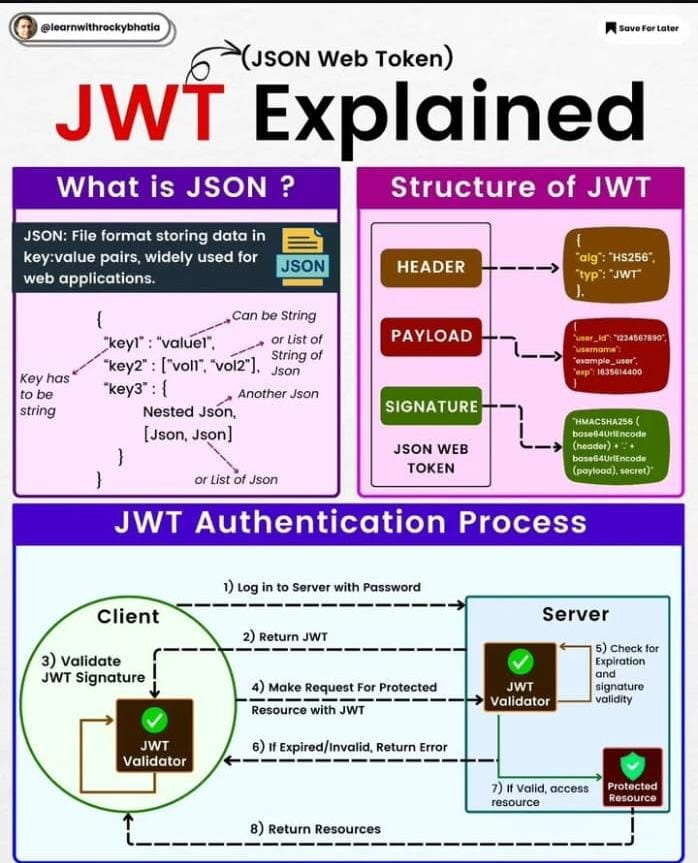

# Spring Security with JWT and OAuth2.0

This are the 4 types in which we provide authorization , authentication in our app
- Spring Security - The inbuilt security feature by Spring Boot
- LDAP - out of scope
- JWT - Authentication and authorization is handled by the token based system
- OAUTH2 - Authentication & authorization handled by token system or some 3rd party integrators like Google , FB etc

# JWT Architecture


# JWT Authentication with Spring boot
1. Install the dependency in pom.xml
    ```dockerfile
   for spring security 
   <dependency>
    <groupId>org.springframework.boot</groupId>
    <artifactId>spring-boot-starter-security</artifactId>
   </dependency>
   
   for spring web 
   <dependency>
    <groupId>org.springframework.boot</groupId>
    <artifactId>spring-boot-starter-web</artifactId>
   </dependency>
   
   for JWT token management , creation etc
   <dependency>
            <groupId>io.jsonwebtoken</groupId>
            <artifactId>jjwt</artifactId>
            <version>0.9.1</version>
    </dependency>
    ```
2. Creating a **JWTTokenManager** class to manage , check , validate and generate a JWT token.  copy_paste
3. Create a **JWTTokenFilter** that extends `OncePerRequestFilter` to create a filter , which is to be included in the filter chain method .
-  we need to implement the `doFilterInternal` method which is responsible to extract the username form the JWT token we pass in the header and
   store the credential into the `SpringContextHolder`
4. We need to make change in the **SecurityConfig** to include the **JwtFilter** and the Session management .
```dockerfile

```
5. we need to crate the `/login` and `/authenticate` api to get the JWT token first time and the
6. At the end we can have a logout handler implemented

# OAuth2.0 with Spring boot
**Difference between OAuth1.0 & OAuth2.0**   https://stackoverflow.com/questions/4113934/how-is-oauth-2-different-from-oauth-1
- **OAuth1.0**
  request token (extra) on the basis of the credentials we provide to Oauth provider used to be generated + that request token was to be used to get the access token (manual step) + with the access token we fetch the user credential and get the user details
- **OAuth2.0**
  we provide credential directly into the oauth providers and then we get the access token +  with the access token we fetch the user credential and get the user details
  OAUTH 2.0  playground_oauth
  OAuth → 3rd party authentication system used mostly today , good for application security.
  here , if the user is valid then the credential of that user ( coming from google , fb , gplus, etc ) is shared to the spring boot app  
  It is a authorization protocol not a authentication protocol


few terminologies
authorization server - The server receives request from Client for granting Access token and issues them upon successful authentication and  consent by the resource owner
** built by different oauth providers like google , github , facebook or you can built your own by the tut-oauth-repo doc
Resource server - A server containing the resources of the user . It receives and validates the Access token from client and return apt resource to it
Client -  a system that requires resources from a resource server . The Client must have a valid access token for it
** we built i.e our spring app
Scope & role - different level of accessing the resources


Architecture of OAUTH 2.0

the developer account is created in an Oauth provider that provides the client id and the client secret key
from the spring app we hit the url https://authorization-server.com/authorize  in which we pass the client id and client secret key so that the authorization server sends back the access token after authentication through the url https://authorization-server.com/code  
the spring app then sends that access token to the resource server for getting the resource


Oauth in spring boot
install the necessary dependencies  + sql driver + spring security + oauth-client


