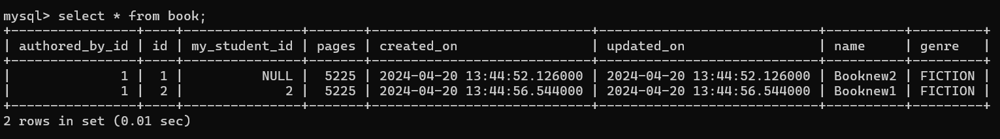

# Online Library Management ( Minor Project 1 )

### Tables present
Author , Book , Student , Transaction

### Database tables
1. Author Table   
   
   

2. Book Table   
     
   

4. Student Table   
    
   

5. Transaction table   
    
   

### Important Relations among tables
1. A Author can write many Books & A Book can be written by one author [ Author : Book :: 1 : N ]
2. A Student can borrow many books & A Book can be borrowed by one Student  [ Student : Book :: 1 : M ] .
> Here it is assumed only one copy of a book exist in library else same name ka boht books store ho rha tha and findBookByName mei list return ho ra tha, so one book can be taken by only one student
3. A Book can have many transactions associated to it [ Book : Transaction :: 1 : M ]
4. A Admin is free to do any no of issue and return Transaction for a student [ student : transaction :: 1 : M ]

### Database Schema

### App functionality
- User can create a Book with its details like name , id , author details
  **make sure that you create author before inserting book**
- User can create 2 type of txn for a student  
    * Issue Txn
        *       1. To start the issue txn we take the book name and student id
                2. Then we are checking whether book is available or not or that student exists or if the book is occupied
                    ( If not then the book and student has to be created from the other endpoints )
                3. If validation success ! then create a txn with pending status
                4. Assign the book to that particular student i.e update book table and set student_id = student passed in the url [ student that tries to book the book ]
                5. Update the txn accordingly with status as SUCCESS or FAILED if any exception occured

    * Return Txn
        *       1. To start the return txn we take the book name and student id
                2. Then we are checking whether book is available or not or that student exists or if that book is genuinely taken by that stuent
                3. If validation success ! then create a txn with pending status
                4. Un-assign the book to that particular student i.e update book table and set student_id = null to deallocate
                5. Update the txn accordingly with status as SUCCESS or FAILED if any exception occured

### APIs
1. Book
- POST - `localhost:9000/book/regbook`   create a new book
- GET : `localhost:9000/book/allbook`   Get all books
- PUT : `localhost:9000/book/updatebook?bid=1`       give update book payload
- DELETE : `localhost:9000/book/delbook?bid=2 ( cannot delete as it is a foreign key table )`
- GET : `localhost:9000/book/search`   Search a book by "name", "author_name", "genre", "pages", "id"
 <pre><code>
payload :
{
    "searchKey" : "genre",
    "searchValue" : "FICTION",
    "operator" : "="
}
</code></pre>

2. Author
- POST : `localhost:9000/author/regauthor`  Create a new author
- GET : `localhost:9000/author/allauthor`   Get all authors

3. Student
- POST : `localhost:9000/student/regstudent`  Creating a new student
- GET : `localhost:9000/student/student/1` Get a student by id
- GET :  `localhost:9000/student/allstudent`  Get all student
- DELETE : `localhost:9000/student/delstudent?sid=1`  Delete a student by id

4. Transaction
- GET : `localhost:9000/transaction/`   Get all transactions
- POST : `localhost:9000/transaction/issue?name=Booknew2&studentId=1`  Start a issue transaction
- POST : `localhost:9000/transaction/return?name=Booknew2&studentId=1` Start a return transaction

### Payloads and response of apis
 <pre>
 <code>
 payload and response :

 New Book 
 payload :
 {
    "name": "Booknew1",
    "genre" : "FICTION",
    "pages" : 5225,
    "author" : 
    {
    "email" : "arindamdutta@mail.com",
    "authorName" : "Arindam Kr. Dutta" ,
    "country" : "INDIA"
    }
}

response :
{
    "id": 1,
    "name": "Booknew1",
    "genre": "FICTION",
    "pages": 5225,
    "createdOn": "2024-04-20T10:42:35.981+00:00",
    "updatedOn": "2024-04-20T10:42:35.981+00:00",
    "authored_by": {
        "id": 1,
        "email": "arindamdutta@mail.com",
        "authorName": "Arindam Kr. Dutta",
        "country": "INDIA",
        "addedOn": "2024-04-20T10:42:35.962+00:00"
    },
    "my_student": null,
    "transactionList_B": null
}

Update Book
payload :
{
    "name": "Booknew1",
    "genre" : "FICTION",
    "pages" : 50505,
    "author" : 
    {
    "email" : "arindamkrdutta@mail.com",
    "authorName" : "Arindam Kumar. Dutta" ,
    "country" : "INDIA"
    }

}
response :
{
    "id": 1,
    "name": "Booknew1",
    "genre": "FICTION",
    "pages": 5225,
    "createdOn": "2024-04-20T10:59:19.049+00:00",
    "updatedOn": "2024-04-20T10:59:21.242+00:00",
    "authored_by": {
        "id": 2,
        "email": "arindamkrdutta@mail.com",
        "authorName": "Arindam Kumar. Dutta",
        "country": "INDIA",
        "addedOn": "2024-04-20T10:59:21.213+00:00"
    },
    "my_student": null,
    "transactionList_B": []
}

New Student
payload :

{
    "name" :"Author Akamai",
    "contact": "8962340776"
}

response :
{
    "id": 1,
    "name": "Author Akamai",
    "contact": "8962340776",
    "createdOn": "2024-04-20T10:56:04.457+00:00",
    "updatedOn": "2024-04-20T10:56:04.457+00:00",
    "bookList_S": null,
    "transactionList_S": null
}

New Author 
payload :
{
   "authorName" : "Arindam",
    "email" : "arindam@mail.com",
    "country" : "INDIA" 
}

response :
{
    "id": 1,
    "email": "arindam@mail.com",
    "authorName": "Arindam",
    "country": "INDIA",
    "addedOn": "2024-04-20T05:50:00.685+00:00",
    "bookList": null
}

Payloads of issue & return txn is not needed

 </code>
 </pre>

### Properties used
<pre>
<code>
spring.datasource.url=jdbc:mysql://localhost:3306/online-library?createDatabaseIfNotExist=true
         #online-library-management db is created inside tables are there
spring.datasource.username= root
spring.datasource.password = admin

spring.jpa.show-sql=true
spring.jpa.hibernate.ddl-auto=create

server.PORT = 9000
</code>
</pre>
