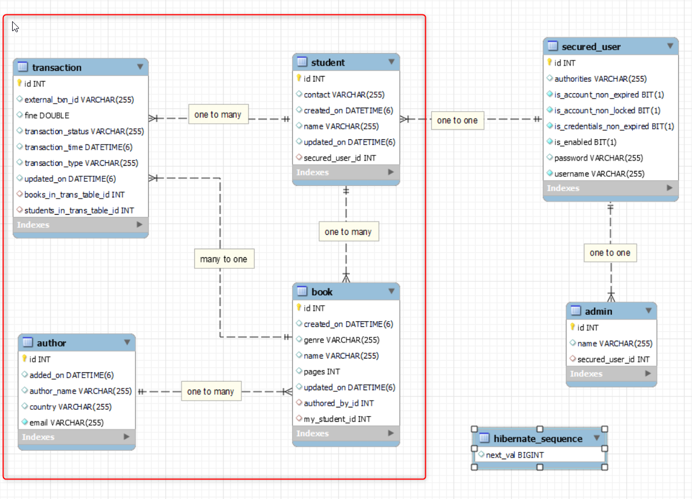

# Online Library Management 2 ( Minor Project 2 )

### Tables present
**For Library**
Author , Book , Student , Transaction

**For Authentication + authorization ( Spring Security )**
SecuredUser , Admin , Student

### Database tables
#### **For Library**
1. Author Table   
       
   
2. Book Table   
     
   
4. Student Table ( little different from MP1 )  
    
    
5. Transaction table   
    
   

#### **For Authentication + authorization ( Spring Security )**
6. SecuredUser Table  
    
    

7. Admin Table  
    
    

8. Student already **_already above exists_**

### Important Relations among tables
**For Library**
1. A Author can write many Books & A Book can be written by one author [ Author : Book :: 1 : N ]
2. A Student can borrow many books & A Book can be borrowed by one Student  [ Student : Book :: 1 : M ] .
> Here it is assumed only one copy of a book exist in library else same name ka boht books store ho rha tha and findBookByName mei list return ho ra tha, so one book can be taken by only one student
3. A Book can have many transactions associated to it [ Book : Transaction :: 1 : M ]
4. A Admin is free to do any no of issue and return Transaction for a student [ student : transaction :: 1 : M ]

**For Spring Security**
5. A SecuredUser table contains all the users of this app , which is 1-2-1 connected with either the Student or Admin table
    [ SecuredUser : Admin :: 1 : 1 ] [ SecuredUser : Student :: 1 : 1 ]

### Database Schema
**For Library**

**For Authentication + authorization ( Spring Security )**

**Entire Schema**

### App functionality
Here we are performing something in extra addition with the MINOR PROJECT 2
        i.e MINOR PROJ 2 + Spring security + redis cache

**Authentication & Authorization**
- At first login is required to access the endpoints . [ Default admin is arindam arindam@123 for the app]
- We have to create a User (can be either a student or admin ) to perform the library functions
- An admin can create new admin or new students

**Library Functions**
- User can create a Book with its details like name , id , author details
  **make sure that you create author before inserting book**
- User can create 2 type of txn for a student  
    * Issue Txn
        *       1. To start the issue txn we take the book name and student id
                2. Then we are checking whether book is available or not or that student exists or if the book is occupied
                    ( If not then the book and student has to be created from the other endpoints )
                3. If validation success ! then create a txn with pending status
                4. Assign the book to that particular student i.e update book table and set student_id = student passed in the url [ student that tries to book the book ]
                5. Update the txn accordingly with status as SUCCESS or FAILED if any exception occured

    * Return Txn
        *       1. To start the return txn we take the book name and student id
                2. Then we are checking whether book is available or not or that student exists or if that book is genuinely taken by that stuent
                3. If validation success ! then create a txn with pending status
                4. Un-assign the book to that particular student i.e update book table and set student_id = null to deallocate
                5. Update the txn accordingly with status as SUCCESS or FAILED if any exception occured

### APIs
To access the below endpoints first authenticate then you can access based on role
1. For Admins [ hardcoded admin : arindam arindam@123 ]
 - POST : `localhost:9000/login?username=arindam&password=arindam@123`    login as default admin Arindam
 - POST : `localhost:9000/admin/new`  to create a new admin
 - GET : `localhost:9000/admin/getall`  to get all admins
 - GET : `localhost:9000/admin/get`     to get currently logged in admin ( implemented SPRING SECURITY )

1. Books endpoint  
**for admins**
 - POST : `localhost:9000/login?username=arindam&password=arindam@123`
 - POST - `localhost:9000/book/regbook`   create a new book
 - PUT : `localhost:9000/book/updatebook?bid=1`       give update book payload 
 - DELETE : `localhost:9000/book/delbook?bid=2 ( cannot delete as it is a foreign key table )`

**for admins or students**
- POST : `localhost:9000/login?username=arindam&password=arindam@123`
- GET : `localhost:9000/book/allbook`   Get all books 
- GET : `localhost:9000/book/search`  Search a book by "name", "author_name", "genre", "pages", "id"
 <pre><code>
payload :
{
    "searchKey" : "genre",
    "searchValue" : "FICTION",
    "operator" : "="
}
</code></pre>

2. Author  
**for admins**
- POST : `localhost:9000/login?username=arindam&password=arindam@123`
- POST : `localhost:9000/author/regauthor`  Create a new author

**for admins or student**
- POST : `localhost:9000/login?username=arindam&password=arindam@123`
- GET : `localhost:9000/author/allauthor`   Get all authors

3. Student  
**for admins and student**
- POST : `localhost:9000/login?username=arindam&password=arindam@123`
- POST : `localhost:9000/student/regstudent`  Creating a new student
- GET : `localhost:9000/student/student/1` Get a student by id 
- GET :  `localhost:9000/student/allstudent`  Get all student

**for student**
- POST : `localhost:9000/login?username=arindam&password=arindam@123`
- DELETE : `localhost:9000/student/delstudent?sid=1`  Delete a student by id 

4. Transaction  
   **for admins and student**
- GET : `localhost:9000/transaction/`   Get all transactions 
- POST : `localhost:9000/transaction/issue?name=Booknew2&studentId=1`  Start a issue transaction 
- POST : `localhost:9000/transaction/return?name=Booknew2&studentId=1` Start a return transaction 

### Payloads and response of apis
 <pre>
 <code>
 _payload and response  :_

 Creating New Admin 
 payload :
 {
    "name" : "Ayush",
    "username" : "ayush",
    "password" : "ayush@123"
}

 Creating New Book 
 payload :
 {
    "name": "Booknew1",
    "genre" : "FICTION",
    "pages" : 5225,
    "author" : 
    {
    "email" : "arindamdutta@mail.com",
    "authorName" : "Arindam Kr. Dutta" ,
    "country" : "INDIA"
    }
}

response :
{
    "id": 1,
    "name": "Booknew1",
    "genre": "FICTION",
    "pages": 5225,
    "createdOn": "2024-04-20T10:42:35.981+00:00",
    "updatedOn": "2024-04-20T10:42:35.981+00:00",
    "authored_by": {
        "id": 1,
        "email": "arindamdutta@mail.com",
        "authorName": "Arindam Kr. Dutta",
        "country": "INDIA",
        "addedOn": "2024-04-20T10:42:35.962+00:00"
    },
    "my_student": null,
    "transactionList_B": null
}

Update Book
payload :
{
    "name": "Booknew1",
    "genre" : "FICTION",
    "pages" : 50505,
    "author" : 
    {
    "email" : "arindamkrdutta@mail.com",
    "authorName" : "Arindam Kumar. Dutta" ,
    "country" : "INDIA"
    }

}
response :
{
    "id": 1,
    "name": "Booknew1",
    "genre": "FICTION",
    "pages": 5225,
    "createdOn": "2024-04-20T10:59:19.049+00:00",
    "updatedOn": "2024-04-20T10:59:21.242+00:00",
    "authored_by": {
        "id": 2,
        "email": "arindamkrdutta@mail.com",
        "authorName": "Arindam Kumar. Dutta",
        "country": "INDIA",
        "addedOn": "2024-04-20T10:59:21.213+00:00"
    },
    "my_student": null,
    "transactionList_B": []
}

Creating New Student
payload :

{
    "name" :"Akamai D",
    "contact": "8962340776" ,
    "username" : "akamai",
    "password" : "akamai@123"
}

response :
{
    "id": 1,
    "name": "Akamai D",
    "contact": "8962340776",
    "createdOn": "2024-05-25T06:10:31.288+00:00",
    "updatedOn": "2024-05-25T06:10:31.288+00:00",
    "bookList_S": null,
    "transactionList_S": null,
    "securedUser": {
        "id": 3,
        "username": "akamai",
        "password": "$2a$10$Cw5hnYaeNxSIUZPrt2b/VOEfMU7VIQYSekDmginQ.sb81WlzeRNou",
        "authorities": [
            {
                "authority": "student"
            }
        ],
        "admin": null,
        "enabled": true,
        "credentialsNonExpired": true,
        "accountNonExpired": true,
        "authoritiess": "student",
        "accountNonLocked": true
    }
}

Creating New Author 
payload :
{
   "authorName" : "Arindam",
    "email" : "arindam@mail.com",
    "country" : "INDIA" 
}

response :
{
    "id": 1,
    "email": "arindam@mail.com",
    "authorName": "Arindam",
    "country": "INDIA",
    "addedOn": "2024-04-20T05:50:00.685+00:00",
    "bookList": null
}

Payloads of issue & return txn is not needed

 </code>
 </pre>

### How cache is implemented ?
 - cache is either implemented when we are fetching the data for the first time or when we are saving the data in the database
 - steps to how to integrate cache already discussed in 05_Spring-demoredis [link](https://github.com/ArindamDutta02082001/Spring_Starter/tree/main/05-Spring-demoredis#integrate-redis-with-spring-boot)
  <pre>
   public studentResponse getStudentById(Integer studentId)
    {
        // implementing the redis-cache
        studentResponse cacheStudent =  studentCacheRepository.getValue(studentId);
        
        // if student detail not present in cache
        if ( cacheStudent == null )
        {
            Student student1 = studentRepository.findById(studentId).orElse(null);
            studentResponse studentResponse = new studentResponse(student1);
           
            studentCacheRepository.setValue(studentId , studentResponse );
            return studentResponse;

        }
   
        // if present then fetch from cache only
        return cacheStudent;
    }
    </pre>

### Properties used
<pre>
<code>
spring.datasource.url=jdbc:mysql://localhost:3306/online-library?createDatabaseIfNotExist=true
         #online-library-management db is created inside tables are there
spring.datasource.username= root
spring.datasource.password = admin

spring.jpa.show-sql=true
spring.jpa.hibernate.ddl-auto=create

server.PORT = 9000
</code>
</pre>
