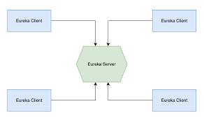

# What is service registry
Service Registry Pattern is a design pattern commonly used in microservices architecture to enable service discovery and dynamic load balancing. In this pattern, microservices register themselves with a service registry, which acts as a central repository for service metadata.

Why using a Service Registry is Beneficial?
Dynamic Service Discovery
Load Balancing
Fault Tolerance and Resilience
Scalability and Elasticity
Service Monitoring and Health Checks

Service registry is a Spring cloud eureka

# How Eureka Works
Eureka serve ris basically is a service registry which registers all the services inside a
microservice architecture project

you have to install 2 depedency for a eureka server service eureka-server 
and for each clients another dependency eureka-discovery-client + change application.properties

The micro service will send periodic signal to the eureka server and
tell that service is alive

The eureka server will monitor the heartbeat and if after a certain period of time if the heartbeat stops that service is assumed to be down by the eureka server

#### open Feign
it simplifies the http calls and communication between the services

advantages of open feign
- Ease of use and eureka integration
- Built in load balancing with ribbon
- support for fallback and circuit breakers

## zipkin  & micrometer
open source distributed tracking system that is used for distributed tracing i.e , how a request is passed from one architecture to another , identify performance bottleneck , error analysis
It helps in performance optimization by seeing the resource usage
the performance is traced by the trace id and the span id

Micrometer is a tool that provides a unified way to collect and report application metrics. It has a concept called an “Observation” which lets you see what has happened during a key operation, such as a web request or a database access.
dependency = gateway + eureka-discovery-client
