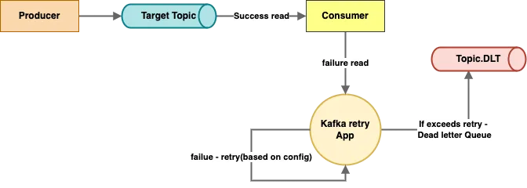

# Kafka

- Open source streaming system used in stream processing , real time data in pipelines at scale
- kafka works based on log based system , the logs are maintained by the zookeeper
- kafka is used not only in push notification service but also in linkedin connection recommendation system ,
  movie recommendation by netflix etc , live location in delivery or cab system, async publisher publish events / message`s in the queue and subscriber subscribes to the queue

**Benefits of Kafka**
1. acts as a messaging queue that provides async communication between different services
2. high throughput due to its distributed nature
2. auto-scaling feature inbuilt in kafka
3. data are replicated in kafka so no loss anyway fault tolerance or single point of failure
4. highly distributed system as msg`s are kept in more than 1 server

**Drawback** : Kafka cannot be used in real time as there can be latency , where we need instant consumption of the messages fom the queue as soon as it is delivered like graviton, stake or like trading systems . Kafka consumers consumes the messages from the queue asynchronously

**Kafka Terminologies**
1. brokers - handles all requests from client ( producer , consume , metadata) and keeps data replicated within the cluster
   **one or more broker = cluster**
2. topics - durable system of collection of logs | microservices talk to each other using kafka-topics |  actual queue that are managed by the server or broker
> partition of a topic : topics are partitioned into n partitions | usually there are same no of brokers as there are partitions | events are produced into topics and finally into partitions
i.e no of broker (replication factor) = no of partitions (partition count)
3. events - each topic contains the events | basically message
> each event that is posted into the topic and finally into the partitions is assigned with a number for identification which we call as offset | the assigning of the events into the partitions are done by kafka itself (unless we explicitly mention)

> order of consumption of events are not uniform , in any random order consumption in done | if we have to maintain the order of events then we have to make sure that we are producing and consuming through a single partition [video](https://www.youtube.com/watch?v=bIaxc14te7U)
4. kafka-producer : send records or events to a topic in a broker
5. kafka-consumer : consume records or events from a topic in a broker
   **one or more consumer = consumer group**
> messages in one partition can be consumed by only and only 1 consumer of a consumer-group but 1 consumer can read from other partitions of multiple topics

> Simple : can u and your friend write simultaneously in a single copy ?
thus , no of consumers in  a consumer grp should be < partition of a topic ( thumb rule )
also consumer will also consume from the partition leader only (thumb rule) as there exists a single leader-partition in the broker

> we dont have control which consumer will consume from which partition , that is coordinated by zookeeper

4. zookeeper : it is auto installed  when you install the kafka | It handles metadata of the kafka | keeps the state of the cluster ( broker , topics , users , offset)

   **Why zookeeper is required ?** Zookeeper acts as the central nervous system for a Kafka cluster, handling coordination (broker membership, leader election, configuration management), service discovery (allowing producers and consumers to find brokers), and synchronization (ensuring distributed processes work together).
   it is a configuration system for kafka . keeps the state of a kafka broker that is how much te broker has read
   and how much that broker has to further read from the queue

**Kafka hierarchy** : kafka-server > cluster of brokers/replicas (each broker have unique broker.id)  > each broker/s ( have same topics and same partitions , among it a leader partition present ) > same topic/s & same partition present in the replica / brokers > events are pushed into the partitions by RR algo
- inside a server there is cluster
- inside cluster there are many brokers , each broker have same content ( same topics and partitions )
- each broker has a particular partition-leader , thus when message is sent into that partition that broker accepts the message form the **producer**
- inside the cluster there is a leader broker which interacts with the **consumer**


#### Q Why decoupling of producer and consumer is needed ? how kafka decouples them ?
In monolithic style it is not possible to scale up . Hence, we need kafka which provides decoupling

thus , no of consumers in  a consumer grp should be < partition of a topic ( thumb rule )
if they are not decoupled then it may happen that the producer produces a half a million of messages and the limited no of consumers are there
so messages keeps on accumulating in the queue .

so the decoupling is req . we can then increase the consumers by asking the producer team to increase the no of partition due to thumb rule
and thus no of partition of a topic solely depends on the producer team handling kafka-producers

#### Q Can we make a consumer consume from a particular partition in a topic ?
yes we can provide th partition-id while creation of the consumer

### Kafka in CLI

1. java jdk is required for kafka
2. to start a kafka we need a zookeeper running first
3. install the .tgz ( kind of zip file for linux specially ) in windows
4. unzip the .tgz and rename the folder to kafka , move inside and run the commands in sequence
   start kafka in cli [medium link](https://medium.com/@beheradebananda000/how-i-installed-apache-kafka-in-windows-11-75f67aa25def)

<pre>

// you can configure the server.properties and the zookeeper.properties file for the PORT no and saving the logs 
// default port is 9092 for kafka server to run , 2181 for zookeeper
// default kafka-logs (managed by zookeeper) are saved in the tmp folder

// start zookeeper server
./bin/windows/zookeeper-server-start.bat config/zookeeper.properties

// start kafka server
./bin/windows/kafka-server-start.bat config/server.properties

// Creating topic 
.\bin\windows\kafka-topics.bat --create --topic medium-events --bootstrap-server localhost:9092

// Describing topic
 .\bin\windows\kafka-topics.bat --describe --topic medium-events --bootstrap-server localhost:9092

// listing all topics
 .\bin\windows\kafka-topics.bat --bootstrap-server localhost:9092 --list

// Producer Command - it will open a cli to enter messages for this topic
.\bin\windows\kafka-console-producer.bat --topic medium-events --bootstrap-server localhost:9092
            we can pass csv files in the kafka producer
            in the terminal we can give bin/customer.csv path 
// Consumer Command - t will open a cli which will show messages when producer hits enter
 ./bin/windows/kafka-console-consumer.bat --topic medium-events --from-beginning --bootstrap-server localhost:9092

</pre>


### Kafka in Spring Boot

1. Install the dependencies `spring-kafka` & `spring-kafka-test` in pom.xml
2. create a **KafkaConfig.java** file which defines the configuration of Kafka Producer or Consumer on the basis of which is needed
```

// copy paste

@Configuration
public class KafkaProducerConsumerConfig {


    // creating the consumer factory : start a consumer line to the kafka server for consuming messages
    @Bean
    ConsumerFactory getConsumerFactory() {
        Map<String, Object> properties = new HashMap<>();
        properties.put(ConsumerConfig.BOOTSTRAP_SERVERS_CONFIG, "localhost:9092");
        properties.put(ConsumerConfig.VALUE_DESERIALIZER_CLASS_CONFIG, StringDeserializer.class);
        properties.put(ConsumerConfig.KEY_DESERIALIZER_CLASS_CONFIG, StringDeserializer.class);

        return new DefaultKafkaConsumerFactory(properties);
    }


    // creating the producer factory : start a producer line to the kafka server for producing messages
    @Bean
    ProducerFactory getProducerFactory(){
        Map<String, Object> properties = new HashMap<>();
        properties.put(ProducerConfig.BOOTSTRAP_SERVERS_CONFIG, "localhost:9092");
        properties.put(ProducerConfig.VALUE_SERIALIZER_CLASS_CONFIG, StringSerializer.class);
        properties.put(ProducerConfig.KEY_SERIALIZER_CLASS_CONFIG, StringSerializer.class);

        return new DefaultKafkaProducerFactory(properties);
    }

    @Bean
    KafkaTemplate <String , String> getKafkaTemplate(){
        return new KafkaTemplate<>(getProducerFactory());
    }

}
```
3. Create a Producer or a Consumer for the service . **We have to Serialize the object before and after consuming the message form kafka-topic**

```
    Create a Producer function in the Service file

    // create & publish the new User in the topic
    public User create(createUserDto createUserDto) throws JsonProcessingException {
        
        User user = new User("a" , 3 , "ass");
        userRepository.save(user);


        // Serialize the User object to JSON Object String
        ObjectMapper objectMapper = new ObjectMapper();
        String userJson = objectMapper.writeValueAsString(user);
        
        // publishing the string into the user_created topic
        kafkaTemplate.send(Constants.USER_CREATED_TOPIC, userJson);                 // main line
        
        // we can send message to a particular partition of a topic
        kafkaTemplate.send(Constants.USER_CREATED_TOPIC, 3 , userJson);                 // main line
        
        
    return user;
    }


    Create a Consumer function in the Service file

        // consuming message from user_created topic of new user creation from a particular partition
       @KafkaListener(topics = "user_created", groupId = "random-id-it-is-needed-else-error" , topicPartitions = {@TopicPartition(topic = "user_created" , parttitons = {"2"})})
       
        // consuming message from user_created topic of new user creation from any partition
        @KafkaListener(topics = "user_created", groupId = "random-id-it-is-needed-else-error")
        public void consumeKafkaEvent(String message) throws JsonProcessingException 
        {
        // consume the message and forming the map of objects from the JSON Object String
        ObjectMapper objectMapper = new ObjectMapper();
        Map<String,Object> event = new HashMap<>();
        event = objectMapper.readValue(message ,Map.class);

        // creating a new wallet as soon as we create a new user
        Wallet wallet = Wallet.builder()
        .balance((Double) event.get("amount"))
        .mobile((String) event.get("mobile"))
        .build();

        walletRepository.save(wallet) ;
        
        }
```

### Kafka error handling
we must ensure that if some message is not consumed from the producer then there is some retry-mechanism after every failed consumption and the non-consumed messages are stored in some DLT-Topic to be consumed for later use


we can mention how many times a consumer have to retry by **@RetryableTopic(attempts = "n")** after that if still that message cannot be consumed is sent to a new **retry-topic** at last after failing in retry it is sent to a **DLT-Topic** from where we can capture the messages by the **@Dlthandler** which gets auto triggered when Dlt-topic gets message [medium_link](https://medium.com/@cobch7/kafka-exception-handling-and-retry-mechanism-a911541321fe)

```
In the producer service file


@RetryableTopic(include = {NullPointerException.class, ArrayIndexOutOfBoundsException.class}, attempts = "4", backoff = @Backoff(delay = 1000, multiplier = 2), topicSuffixingStrategy = TopicSuffixingStrategy.SUFFIX_WITH_INDEX_VALUE,
retryTopicSuffix = "-custom-try",
dltTopicSuffix = "-dead-t")
@KafkaListener(topics = "user-created",groupId = "grp-id")
public void consumeUser(ConsumerRecord<String, schema.avro.User> record) {
schema.avro.User user = record.value();
....
....
....
} 

@DltHandler
public void listenDlt(String in, @Header(KafkaHeaders.RECEIVED_TOPIC) String topic, @Header(KafkaHeaders.OFFSET) long offset) {
  this.logger.info("DLT Received: {} from {} offset {}", in, topic, offset);
} 
```