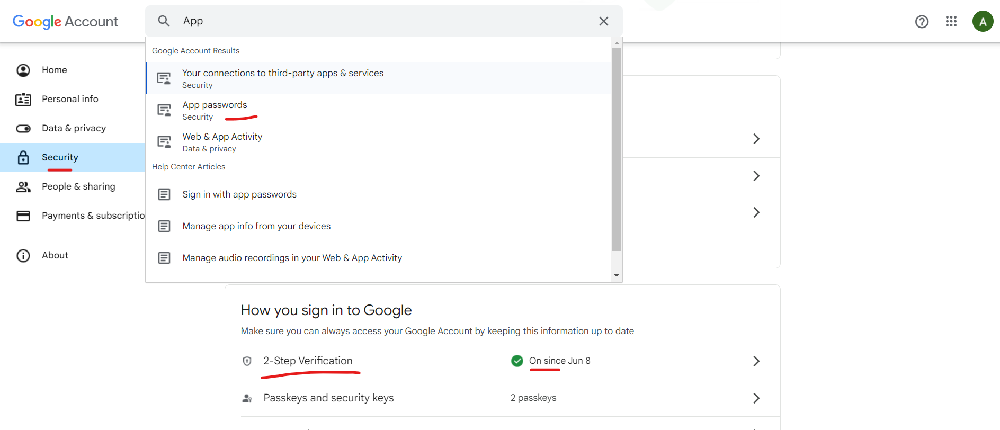

# Notification Service

- the messages are consumed from the `wallet_updated` topic in which the events are pushed by the **Transaction Service**
- A smtp server is set up using the dependency 
    ```dockerfile
             <dependency>
            <groupId>org.springframework.boot</groupId>
            <artifactId>spring-boot-starter-mail</artifactId>
             </dependency>
    ```
  
### How to set up a smtp server 
- here we have the access of gmail smtp server , by default a smtp mail server runs on 587 port
- Go to Gmail ( of which you want to get a smtp server )
- go to **Manage My Account**
- go to **Security** , and turn on the 2-factor authentication
- In the above search bar search **App Password** click there
- create a new app and copy that password . This App will give your Spring boot app the access to use the Gmail SMTP server to send mails 

- After the smtp server is set up copy the **mailId & App password**

### smtp access configuration
```dockerfile
# ****************** Simple mail properties *********************
spring.mail.host=smtp.gmail.com     // telling which company smtp to be used
spring.mail.port=587                // setting the port
spring.mail.username = arindamdutta1970@gmail.com   // setting the mailId
spring.mail.password = lqip smpj eejq xqqw          // setting the App Password
spring.mail.properties.mail.smtp.auth=true          
spring.mail.properties.mail.smtp.starttls.enable=true
# *********************************************************
```