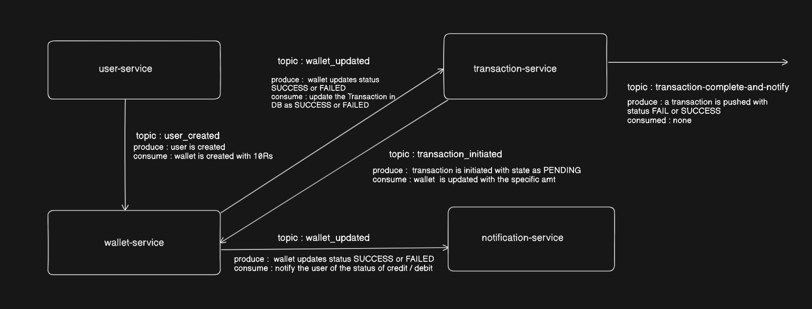

# Payment Backend

### services present
1. user service - to register and fetch  details of the user
2. wallet-service - to create a wallet of a user , fetch all transaction history , fetch balance
3. transaction-service - to initiate transaction between 2 users , fetch all transaction history of a user
4. notification-service - to send gmail notification to the sender and receiver 


### Architecture 



### Apis 
1. user-service
- Register a new user : POST `localhost:4000/user/new`
 ```dockerfile
payload :
{
  "name": "Arindam",
  "mobile": "9620922432",
  "email": "arindamdutta02082001@gmail.com",
  "password": "Arindam@123"
}
```
- get user details based on ID : GET `localhost:4000/user/details?id=2`
- get user details based on mobile : GET `localhost:4000/user/mobile/9620922432`

2. transaction-service
- initiate a new transaction between 2 users : POST `localhost:7000/txn/initiate-txn/<sender-mobile>`
 ```dockerfile
payload :
{
  "receiver": <receiver-mobile>,
  "amount": "2",
  "purpose": "donate"
}
```
- get transaction history of a sender  : GET `localhost:7000/txn/txn-history/<sender-mobile>`

3. wallet-service
- check wallet balance of a user : GET `localhost:5000/wallet/balance/9620922432`
- get transaction history of a sender  : GET `localhost:5000/wallet/wallet-history/<sender-mobile>`
